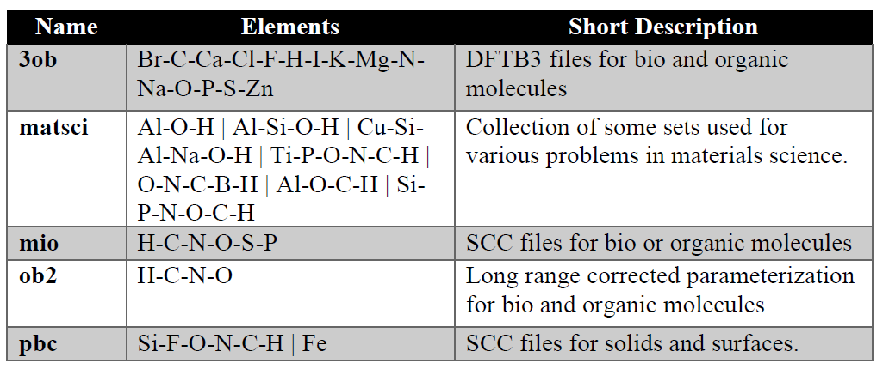
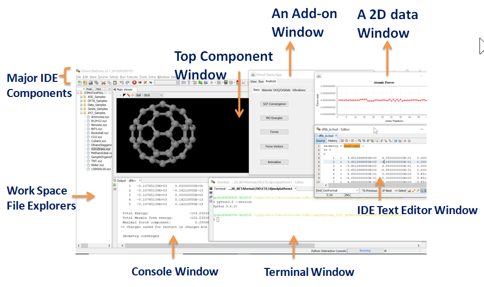

.. title:: Chapter-1 HTML documentation

========================
Chapter 1: Introduction
========================
DJMol is an ongoing open source (licensed with GPL v3 or later) ‘Modeling Platform’ project and 
it is architectured for performing various simulations in computational materials science / chemistry. 
It is a free, object-oriented software developed by IKST, (Indo-Korea Science and Technology Centre, 
17/1, Bellary Rd, Yashoda Nagar, Yelahanka, Bengaluru, Karnataka 560064), Bangalore.

In its core level, DJMol is integrated with widely accepted and open source (GPL/LGPL ) 
computational software, such as,
DFTB+ (University of Bremen, Germany), the default calculator of DJMol
Atomic Simulation Environment (ASE, Technical University of Denmark)
SIESTA (Institut de Ciencia de Materials de Barcelona (ICMAB), Spain)
OpenMD (University of Notre Dame., USA).

The main target of this software is the researchers (including experimentalists) 
and academicians and industrial researchers. In addition to this, a site, 
https://sites.google.com/view/djmolplatform is created for more technical details, 
updates and demonstration videos/notes etc. The code-development resources are recently included in its official site, www.djmol.info .

As mentioned before, the software is integrated with DFTB+ (as its default calculator), 
and Siesta (for higher level DFT calculations), along with ASE and OpenMD,. Hence a short review 
on these packages is added for a quick-reference.

Computational Tools
====================

Here, a short overview of the four main components of the platform is described.

**DFTB+:** DFTB (Density functional tight binding) method is an electronic structure method which is specially 
designed to model large molecular/crystal/nano-systems. The origin of this method is routed in DFT 
itself, which is, arguably, the most popular ab initio method in computational materials science or 
in quantum chemistry. It is developed in 80’s and it has been introduced into the computational 
chemistry area mainly by work of Prof. Helmut Eschrig, Prof. Gotthard Seifert, and Prof. T
homas Frauenheim et. al. Since it uses DFT parameters, DFTB is also known as approximate DFT method.

This method uses atomic parameters (as it is stored in the SK file set, a text file) 
which are generated from highly accurate atomic DFT calculations using PBE functional. 
It also consists of diatomic repulsive potentials from B3LYP functional. Note that DFTB+ 
uses minimal valence basis set (numerical Slater type AOs) and one has to explicitly specify a 
particular SK data file for a given calculation.

A list of SK **file set** list is given below (see, www.dftb.org), which is by default, 
added in the DJMol suite. Other SK file which are not included (such as, <3ob:freq> set 
which requires <3ob>) should manually incorporate into their input scripts (it is freely available); 
For more details, see: https://www.dftbplus.org/ and https://www.dftb.org/parameters/download/

   Table 1: Set of common SK data set.

**SIESTA:** Spanish Initiative for Electronic Simulations with Thousands of Atoms is a fast 
(since it uses linear scaling DFT methods) density functional theoretical code which uses 
pseudopotentials. It can handle molecular as well as extended systems (metals, polymers, 
defects in the metals, surfaces etc.) It is a free code and for more details see: 
https://departments.icmab.es/leem/siesta. And routinely it can be used to predict:

* Total and partial energies.
* Atomic forces.
* Stress tensor.
* Electric dipole moment.
* Atomic, orbital and bond populations (Mulliken).
* Electron density.
* Geometry relaxation, fixed or variable cell.
* Constant-temperature molecular dynamics (Nose thermostat).
* Variable cell dynamics (Parrinello-Rahman).
* Spin polarized calculations (collinear or not).
* k-sampling of the Brillouin zone.
* Local and orbital-projected density of states.
* COOP and COHP curves for chemical bonding analysis.
* Dielectric polarization.
* Vibrations (phonons).
* Band structure.
   
Note that at present TranSiesta (electron transport module) is not supported by DJMol.

Since Siesta uses Numerical Atomic Orbital (i.e. localized basis set) as its basis, 
some familiarity with these sets are highly appreciated. Note that a user can give ‘Basis set’ 
information to Siesta in two different ways. The most simple method is to provide a ‘keyword’of the 
basis set. See the next table for its details:

.. list-table:: Table-2: A set of common basis set in Siesta. 
   :widths: 25 25 25 25 25 25 25
   :header-rows: 1
   :align: center

   * - Single-Zeta
     - Double-Zeta
     - Triple-Zeta
     - Single-Zeta Polarized
     - Double-Zeta Polarized	
     - Triple-Zeta Polarized	
     - Triple-Zeta Double-Polarized
   * - SZ	
     - DZ	
     - TZ	
     - SZP	
     - DZP	
     - TZP	
     - TZDP

However, for advanced calculations a user can also give the basis set data explicitly. Refer Siesta manual for its description.
Apart from the basis set, one should also select an appropriate pseudopotential (PP). 
For more details, see:

[1]https://departments.icmab.es/leem/siesta/Pseudopotentials/index.html or,

[2]https://departments.icmab.es/leem/siesta/Databases/Pseudopotentials/periodictable-gga-abinit.html

The first link redirects to ATOM program which can be used to generate PP for elements within the GGA/LDA functionals. The second link gives a database of PP
which was converted from the Abinit PP. Note that choosing PP is a crucial step in Siesta calculation so a user must be Very Careful at this step.       

**Note: By default, DJMol use PP from the Second link [2].**

.. figure:: _static/webdocimages/002.png
   :alt: 002
   :align: center
   :scale: 60%

   The pseudopotentials of Abinit which is converted for Siesta (figure courtesy: ICMAB)

**A note on Functionals:** In Siesta you can specify either LDA or GGA type functionals in a 
<.fdf> input file. 

For example, see below for a part of the <fdf> file, which define functionals :

.. list-table:: Table-3: Specefication of functional in Siesta FDF file. 
   :widths: 8 8 20 
   :header-rows: 0
   :align: center

   * - XC.functional 
     - LDA                      
     - # Exchange-correlation functional ( GGA can be also used)
   * - XC.authors               
     - CA            
     - # Particular parametrization of xc func.
   * - SpinPolarized           
     - .false.        
     - # Spin unpolarized calculation
    
.. list-table:: Table-4: Set of choice of **XC.authors** (with its type) variables.
    :widths: 8 8 
    :header-rows: 0
    :align: center

    * - CA (equivalent to PZ)   
      - A LDA type   
    * - PW92      
      - LDA                 
    * - PW91        
      - GGA                
    * - PBE    
      - GGA                    
    * - revPBE    
      - Modified GGA-PBE                  
    * - RPBE             
      - Modified GGA-PBE            
    * - WC               
      - Modified GGA-PBE           
    * - AM05             
      - Modified GGA-PBE            
    * - PBEsol           
      - Modified GGA-PBE           
    * - PBEJsJrLO            
      - GGA-PBE        
    * - BLYP (equivalent to LYP)   
      - GGA 
    * - DRSLL (equivalent to DF1)  
      - van der Waals density functional (vdW-DF)  
    * - LMKLL (equivalent to DF2)  
      - vdW-DF functional
    * - KBM   
      - vdW-DF functional                     
    * - C09       
      - vdW-DF functional                 
    * - BH     
      - vdW-DF functional                    
    * - VV   
      - vdW-DF functional                      	
 
For a complete specification on <fdf> input format please read the Siesta Manual (v 4.0 or greater). 
The DJMol, is currently equipped with a SIESTA 4.1 version (with OpenMP support) and a number of 
its pre - as well as post-processing tools. 

**ASE:** Atomic Simulation Environment - is a Python based LGPL library which comprises a variety of 
post processing tools or methods. A general outline of ASE is following (block diagram courtesy: 
Dr. A H Larsen)

.. figure:: _static/webdocimages/003.png
   :alt: 003
   :align: center
   :scale: 90%

   Different modules in ASE. Interface denotes the DJMol platform.

One should note that to use ASE, a minimum-level knowledge on Python programming language (version 3.x) 
is a mandate. See Appendix-A for a basic course on Python programming.  ASE’s input should written in 
an object-oriented style, so that the syntax of the input is highly flexible and it can be used to perform 
a series of jobs, by using, say, a for-loop. Another advantage is, it can be effectively coupled with other 
python base libraries such as NumPy, Matplotlib etc. to create different types of output files or data set.

Most useful tasks with ASE are: structure optimization (with or without constraints), molecular dynamics, 
and performing nudged elastic band calculations or its variants. For more details see: 
https://wiki.fysik.dtu.dk/ase/.

**OpenMD:** it is an MD tool based on force-field type potential and it is widely used for performing MD 
simulations of open systems (such as  liquids, proteins, nanoparticles, interfaces, and other complex 
systems). Note that we used 2.6 version of the program. The code is written in C++ and uses Python for 
its data pre/post processing. In the DJMol CygWin based C++ binaries are used and it is kept in ./OpenMD 
folder with other relevant parameter-files, Python scripts etc.

The OpenMD manual is accompanied with the DJMol and it is available at: http://openmd.org/wp-content/docs/OpenMD-2.6.pdf

OpenMD uses a range of programs and Python scripts and a user must familiarize with its uses before the 
production calculation. Examples of OpenMD is illustrated in: http://openmd.org/category/examples/ .

.. list-table:: Table-5: Important binaries of OpenMD and its descriptions.
    :widths: 10 10
    :header-rows: 0
    :align: center

    * - openmd.exe	
      - The Main OpenMD Executable for MD run.
    * - atom2omd.exe	
      - atom2omd attempts to construct .omd files from files containing only atomic coordinate information
    * - Dump2XYZ.exe	
      - Converts an OpenMD dump file into a file suitable for viewing in a molecular dynamics viewer.
    * - DynamicProps.exe	
      - Computes time correlation functions like the velocity autocorrelation function, or the mean square displacement.
    * - elasticConstants.exe	
      - elasticConstants computes the general elastic constants that relate stress and strain for a given input configuration.
    * - Hydro.exe	
      - Hydro generates hydrodynamic resistance tensor (.hydro) files which are required when using the Langevin integrator using complex rigid bodies.
    * - icosahedralBuilder.exe	
      - icosahedralBuilder creates single-component geometric solids that can be useful in simulating nanostructures.
    * - nanoparticleBuilder.exe, nanorodBuilder.exe, nanorod\_	
      - programs to construct nanoparticles of various sizes and geometries.
    * - omd2omd.exe	
      - omd2omd is a utility script which helps in replicating, rotating, and translating already built OpenMD .omd, .dump, and.eor files.
    * - randomBuilder.exe, simpleBuilder.exe	
      - generate crystals.
    * - recenter.exe	
      - recenter is a utility script which moves all integrable objects in an OpenMD file so that the center of mass is at the origin.
    * - SequentialProps.exe	
      - Computes a time history of static properties from a dump file.
    * - StaticProps.exe	
      - Computes static properties like the pair distribution function.
    * - thermalizer.exe	
      - Thermalizer gives the atoms some initial velocities (at a given temperature) before the  equilibration.

.. table:: Truth table for "not"
    :widths: auto
    :align: center 

    +----------------------------+------------------------------------------------------------------------------------------------------------------------------------------------------------------------------------------------------------------------------------------+
    | affineScale.py             | OpenMD affine scaling transform                                                                                                                                                                                                          |
    |                            | Takes an OpenMD file and scales both the periodic box and the coordinates of all StuntDoubles in the system by the same amount.                                                                                                          |
    |                            |                                                                                                                                                                                                                                          |
    |                            | You can either specify a new volume scaling for isotropic scaling, or specify one (or more) of the coordinates for non-isotropic scaling.                                                                                                |
    |                            |                                                                                                                                                                                                                                          |
    +----------------------------+------------------------------------------------------------------------------------------------------------------------------------------------------------------------------------------------------------------------------------------+
    | dumpConverter.py           | Dump File Converter Converts old-style OOPSE md and dump files into new OpenMD style combined files                                                                                                                                      |
    +----------------------------+------------------------------------------------------------------------------------------------------------------------------------------------------------------------------------------------------------------------------------------+
    | funcflExtractor.py         | Funcfl Extractor Opens an DYNAMO86 EAM funcfl file, parses the data and writes out separate files for F[rho], rho(r), and Z(r)                                                                                                           |
    |                            |                                                                                                                                                                                                                                          |
    +----------------------------+------------------------------------------------------------------------------------------------------------------------------------------------------------------------------------------------------------------------------------------+
    |                            |                                                                                                                                                                                                                                          |
    | hbtetAnalyzer.py           | It is used for doing analysis on Hydrogen Bond Tetrahedrality matrices                                                                                                                                                                   |
    +----------------------------+------------------------------------------------------------------------------------------------------------------------------------------------------------------------------------------------------------------------------------------+
    | hydroExplainer.py          | Computes predicted diffusion constants and rotational relaxation times from a hydro file.  Explains the values in the hydro file in terms of properties that can be calculated from a molecular dynamics simulation.                     |
    |                            |                                                                                                                                                                                                                                          |
    +----------------------------+------------------------------------------------------------------------------------------------------------------------------------------------------------------------------------------------------------------------------------------+
    | lcorrzFit.py               | A utility script to analyze of Legendre correlation functions                                                                                                                                                                            |
    +----------------------------+------------------------------------------------------------------------------------------------------------------------------------------------------------------------------------------------------------------------------------------+
    | omdLast.py                 | OpenMD File Extractor: Makes omd file from the last good frame of OpenMD dump file.                                                                                                                                                      |
    +----------------------------+------------------------------------------------------------------------------------------------------------------------------------------------------------------------------------------------------------------------------------------+
    | omdShrink.py               | OpenMD File Trimmer: Skips every n frames of an OpenMD dump file and loads it into new dump file                                                                                                                                         |
    +----------------------------+------------------------------------------------------------------------------------------------------------------------------------------------------------------------------------------------------------------------------------------+
    | omd-solvator.py            | OMD Solvator: Opens two omd files, one with a solute structure and one with a solvent structure.  Deletes any solvent molecules that overlap with solute molecules and produces a new combined omd file.  The output omd                 |
    |                            | file must be edited to run properly in OpenMD.  Note that the two boxes must have identical box geometries (specified on the Hmat line).                                                                                                 |
    |                            |                                                                                                                                                                                                                                          |
    +----------------------------+------------------------------------------------------------------------------------------------------------------------------------------------------------------------------------------------------------------------------------------+
    | omdSplit.py                | OpenMD File Splitter: Splits OpenMD dump file frames into separate omd files                                                                                                                                                             |
    +----------------------------+------------------------------------------------------------------------------------------------------------------------------------------------------------------------------------------------------------------------------------------+
    | pack2omd.py                | Packmol RigidBody Replacer: Finds atomistic rigid bodies in a packmol-generated xyz file and generates an OpenMD (omd) file with center of mass and orientational coordinates for rigid bodies.                                          |
    |                            |                                                                                                                                                                                                                                          |
    +----------------------------+------------------------------------------------------------------------------------------------------------------------------------------------------------------------------------------------------------------------------------------+
    | principalAxisCalculator.py | It opens an XYZ file and computes the moments of inertia and principal axes for the structure in the XYZ file.  Optionally rotates the structure so that the long axis (that with the smallest eigenvalue) is pointing along the z-axis. |
    |                            |                                                                                                                                                                                                                                          |
    +----------------------------+------------------------------------------------------------------------------------------------------------------------------------------------------------------------------------------------------------------------------------------+
    | protonSampler.py           | This python script will generate proton disordered configurations of ice-Ih, given an input of the (.xyz) coordinates of the oxygen positions in the lattice.                                                                            |
    +----------------------------+------------------------------------------------------------------------------------------------------------------------------------------------------------------------------------------------------------------------------------------+
    | slabBuilder.py             | SlabBuilder to create starting omd files for arbitrary surface cuts specified by Miller indices (hkl) of FCC, BCC and SC materials                                                                                                       |
    +----------------------------+------------------------------------------------------------------------------------------------------------------------------------------------------------------------------------------------------------------------------------------+
    | slipLength.py              | slipLength is a built in analysis script which can compute the slip-length of a solid-liquid interface under shear. The script assumes the solid is placed in the middle of the box, with equal amounts of liquid on either side.        |
    +----------------------------+------------------------------------------------------------------------------------------------------------------------------------------------------------------------------------------------------------------------------------------+
    | solLiqFricCalc.py          | Used for calculating solid liquid friction coefficients                                                                                                                                                                                  |
    +----------------------------+------------------------------------------------------------------------------------------------------------------------------------------------------------------------------------------------------------------------------------------+
    | solvator.py                | A script that reads in a water box and solute xyz (or pdb), merges the two systems, and                                                                                                                                                  |
    |                            | deletes overlapping molecules                                                                                                                                                                                                            |
    |                            |                                                                                                                                                                                                                                          |
    +----------------------------+------------------------------------------------------------------------------------------------------------------------------------------------------------------------------------------------------------------------------------------+
    | stat2dielectric.py         | A script that computes the static dielectric constant.                                                                                                                                                                                   |
    +----------------------------+------------------------------------------------------------------------------------------------------------------------------------------------------------------------------------------------------------------------------------------+
    | stat2dipolecorr.py         | A script that computes the system dipole correlation function                                                                                                                                                                            |
    +----------------------------+------------------------------------------------------------------------------------------------------------------------------------------------------------------------------------------------------------------------------------------+
    | stat2tension.py            | Used for computing surface tensions from pressure tensors in stat files                                                                                                                                                                  |
    +----------------------------+------------------------------------------------------------------------------------------------------------------------------------------------------------------------------------------------------------------------------------------+
    | stat2thcond.py             | Computes the correlation function of the heat flux vector that has been stored in a stat file.   These can be used to compute the thermal conductivity.                                                                                  |
    |                            |                                                                                                                                                                                                                                          |
    +----------------------------+------------------------------------------------------------------------------------------------------------------------------------------------------------------------------------------------------------------------------------------+
    | stat2visco.py              | Computes various correlation functions of the pressure and pressure tensor that have been stored in a stat file.   These can be used to compute shear and bulk viscosities.                                                              |
    |                            |                                                                                                                                                                                                                                          |
    +----------------------------+------------------------------------------------------------------------------------------------------------------------------------------------------------------------------------------------------------------------------------------+
    | vcorr2spectrum.py          | A script that processes a velocity autocorrelation function into a amplitude spectrum Post-processes a vcorr file and creates a normalized spectrum.                                                                                     |
    +----------------------------+------------------------------------------------------------------------------------------------------------------------------------------------------------------------------------------------------------------------------------------+
    | waterBoxer.py              | builds a lattice of water molecules in a periodic box                                                                                                                                                                                    |
    +----------------------------+------------------------------------------------------------------------------------------------------------------------------------------------------------------------------------------------------------------------------------------+
    | waterReplacer.py           | Finds atomistic waters in an xyz file and generates an OpenMD (omd) file with center of mass and orientational coordinates for rigid body waters.                                                                                        |
    +----------------------------+------------------------------------------------------------------------------------------------------------------------------------------------------------------------------------------------------------------------------------------+
    | waterRotator.py            | Samples water orientations from a list of known good orientations                                                                                                                                                                        |
    |                            |                                                                                                                                                                                                                                          |
    +----------------------------+------------------------------------------------------------------------------------------------------------------------------------------------------------------------------------------------------------------------------------------+
    | wcorr2spectrum.py          | A script that processes a charge velocity autocorrelation function into a amplitude spectrum ;Post-processes a wcorr file and creates a normalized spectrum.                                                                             |
    +----------------------------+------------------------------------------------------------------------------------------------------------------------------------------------------------------------------------------------------------------------------------------+

Major Components of the Software
===================================
DJMol program is, in essence, a rich client platform (RCP) GUI application that has been built on the top 
of the RCP framework of the Netbeans IDE. The underlying OOP paradigm permits simple and straight-forward 
addition and extension of extra modules or plug-ins into its RCP frame work. This application can also be 
viewed as a molecular workbench that integrates many application programs for modeling molecular systems 
into a single framework. The main components of the GUI are discussed below.

(1)Basic IDE components: As indicated earlier the IDE component, inherited from Netbeans RCP module, is 
the core part the user-interface. The IDE framework offers a standard set of tools dedicated for advanced 
programming or scripting tasks. IDE significantly improve productivity of its users since it automates 
several text based processes (code completion, version control, project management, restoring old versions
of the text files etc.). Several of native IDE menus are integrated; e.g. the File menu selects a 
coordinate data by its file extension (eg. xyz or hsd) to visualize the structure and open its text to 
the text editor of the IDE. Note that in the current version of the program xyz or hsd files are 
selected as the default file extensions for the viewer. The selected file can be manipulated at 
different levels by using its Edit, View and Source menus. Other basic IDE features like refactoring 
of files, Git facility, visual diff utility (to compare the contents of two text files) etc. are also 
supported. Project Explorer - which is placed on the far left side - shows the packages (directories 
and it files) that make up Python projects; It can also be used to systematically arrange or manipulate 
other data. Files and Favorite explorer panels are two tools for managing files (including binaries) in 
general. See Fig A for the IDE text editor which displays a Python script.

   A Python script is displayed in the IDE text editor with syntax highlighting option.

(2)Top Component Window: The center panel of the software is set to display molecules and it embeds an 
unabridged Jmol visualizer binary and it is used in the TopComponent class (the basic unit of RCP display). 
Optionally a scripting tool (for Jmol scripting) can be invoked from this panel to create more sophisticated 
and customized molecular visualizations (See Table 5).  

.. list-table:: Table-7: Some selected one-liner commands of Jmol scripts and its descriptions.
    :widths: 10 15
    :header-rows: 0
    :align: center

    * - :math:`\texttt{load =cod/1000373 {2,2,2}}`
      - Loads 2x2x2 supercell of NaVO2F2 from COD database
    * - :math:`\texttt{minimize}`
      - Molecular mechanics (UFF) steepest descent minimization
    * - :math:`\texttt{write "C:\\file.pdb"}`
      - Save the molecule into a PDB file
    * - :math:`\texttt{isosurface cutoff 0.01 "C:\\cube.gz"}`
      - Visualize an isosurface from a gzipped CUBE file
    * - :math:`\texttt{q=quaternion()}`	
      - Saving orientation in quaternion rather than Euler angles

(3)2D and 3D Data Windows: JFreeChart library (a Java library for displaying various types of 
scientific data) is used to create a 2D graphs and it is usually projected onto a JPanel (a 
Swing GUI widget toolkit) to display the plots. By this, one can add more control options to the 
rendered graphs (See, Fig-D for a 2D plot with more control options). It is the default 2D data plot 
library of the DJMol and it has several graphic styles and it offers many configuration options to 
customize the rendering of graphics and it export the graphic content in PNG format. Apart from this, 
Matplotlib library is also used to display 2D graphics especially with Siesta add-on. The 3D graphics 
(scalar volumetric data such as density isosurface) windows all are embedded with Jmol application with 
some internal Jmol script commands. To manipulate the 3D data either Jmol scripts or Pythons scripts are used. 
For example, a Python script is used to convert xsf file format (which is frequently used in Siesta) into 
the cube format. 

(4)Terminal Window: One can run OS commands and Python scripts with this window. Note that in the Windows 
version of the program the CygWin environment is automatically linked with this terminal. If necessary, 
WSL (a compatibility layer for running native Linux executables under Windows 10 OS) can also be linked. 
See the manual for more details. The plug-in for the Python integration into the software can be switched 
to get Python 2.x as well as Python 3.x. It gives the terminal based (interactive mode) access to the 
language. As an example, by using this terminal one can install many additional packages like ASE or 
Matplotlib library. Using SSH commands of CygWin or WSL this terminal can be connected with other remote 
machines.

(5)Console Window: This window is usually placed immediately below the Top Component window and it is 
mainly used to display console output text (eg. to show DFTB+ output when it runs). It also contains Start 
and Stop buttons to execute the DFTB+ program. The log text from this window can be saved or post processed, 
optionally.

(6)Add-on Windows: Other major window components are from the add-on programs based on Swing API. 
Currently there are six add-ons are constructed and all these programs are independent of each other. 
And these add-ons are built from JFrame – the base container of the application. At present it supports 
all the AWT (abstract window toolkit) components. Although more recent JavaFX class to create desktop 
applications exist in Java, we always used Swing based GUIs since more libraries and tools are available 
for Swing API.

Schematically all these key GUI components are shown in the figure below:

   A schematic classification of major window components which constitute the entire GUI of DJMol program.